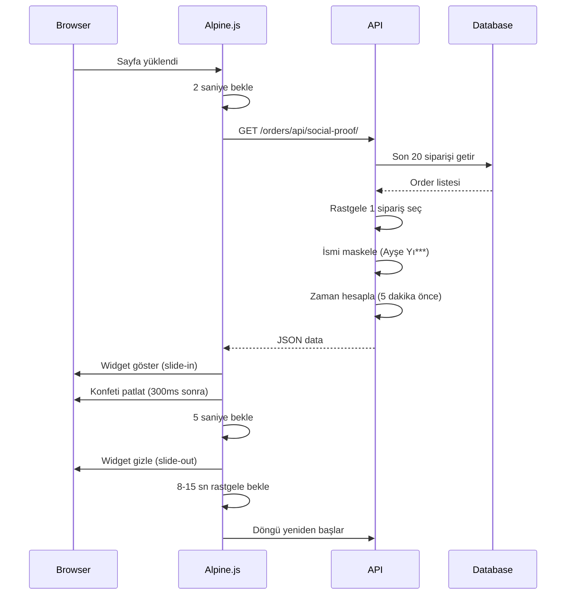

# 🔔 Social Proof (Sipariş Bildirimleri) Sistem Analizi

## 📊 Sistem Genel Bakış

Social Proof sistemi, gerçek sipariş verilerini kullanarak ziyaretçilere "şu anda başkaları da alışveriş yapıyor" hissi veren dinamik bildirim widget'ıdır.

---

## 🏗️ Mimari

### 1. Frontend (Template)
**Dosya:** `templates/includes/social_proof.html`
- **Konumu:** Ekranın sol alt köşesi (`fixed bottom-6 left-6`)
- **Framework:** Alpine.js (reactive state management)
- **Animasyon:** Cubic-bezier ile bounce efektli giriş/çıkış
- **Ekstra:** Confetti.js ile konfeti animasyonu

### 2. Backend (API)
**Dosya:** `orders/views.py` → `social_proof_api()` (141-231. satırlar)
**Endpoint:** `/orders/api/social-proof/`
**Method:** GET
**Response:** JSON

### 3. Entegrasyon
**Dosya:** `templates/base.html` (254. satır)
```django

```
Tüm sayfalarda aktif (global include)

---

## 🎯 Nasıl Çalışır?

### 🔄 İş Akışı



---

## 📋 API Detayları

### Request
```http
GET /orders/api/social-proof/
```

### Response Formatı
```json
{
  "name": "Ayşe Yı***",
  "location": "İstanbul",
  "product_name": "Pamuklu Tunik",
  "product_image": "/media/products/tunik_0.jpg",
  "product_description": "Yazlık pamuklu tunik, rahat ve şık...",
  "time_ago": "3 dakika önce"
}
```

### Backend Mantığı

#### 1. **Sipariş Seçimi** (146-155. satırlar)
```python
recent_orders = Order.objects.filter(
    status__in=['new', 'processing', 'shipped', 'delivered']
).select_related('city_fk').prefetch_related('items__product__images').order_by('-created_at')[:20]

order = random.choice(recent_orders)
```
- Son 20 siparişi getirir
- Rastgele birini seçer
- **Optimizasyon:** `select_related` ve `prefetch_related` ile N+1 problem önlendi

#### 2. **İsim Maskeleme** (157-178. satırlar)
```python
# Örnek: "Ayşe Yılmaz" → "Ayşe Yı***"
full_name = "Ayşe Yılmaz"
first_name = "Ayşe"
last_name = "Yılmaz"
masked_last = "Yı***"
result = "Ayşe Yı***"
```
**Gizlilik:** Müşteri mahremiyeti korunur

#### 3. **Lokasyon** (180-187. satırlar)
```python
if order.city_fk:
    location = order.city_fk.name  # ForeignKey'den
elif order.city:
    location = order.city  # Text field'dan (fallback)
else:
    location = "Türkiye"  # Default
```

#### 4. **Zaman Hesaplama** (207-220. satırlar)
```python
if diff.total_seconds() < 300:  # 5 dakika altı
    time_ago = "Şimdi"
else:
    time_ago = timesince(order.created_at)
    # "2 minutes" → "2 dakika önce"
```

---

## 🎨 Frontend Detayları

### Alpine.js Store
```javascript
Alpine.data('socialProof', () => ({
    visible: false,  // Widget görünür mü?
    data: {          // API'den gelen data
        name: '',
        location: '',
        product_name: '',
        product_description: '',
        product_image: '',
        time_ago: ''
    },
    
    init() {
        setTimeout(() => this.startCycle(), 2000); // İlk başlatma
    },
    
    async fetchNewData() {
        // API çağrısı
    },
    
    triggerConfetti() {
        // Konfeti animasyonu
    },
    
    async startCycle() {
        // Ana döngü mantığı
    }
}))
```

### Döngü Zamanlaması

1. **İlk gösterim:** Sayfa yüklendikten 2 saniye sonra
2. **Widget görünür kalma süresi:** 5 saniye
3. **Sonraki gösterim:** 8-15 saniye arası rastgele bekleme
4. **Toplam döngü:** ~13-20 saniye arası

```javascript
// 1. Başlangıç gecikme
setTimeout(() => this.startCycle(), 2000);

// 2. Widget 5 saniye görünür
setTimeout(() => {
    this.visible = false;
    
    // 3. 8-15 saniye rastgele bekle
    const randomDelay = Math.floor(Math.random() * (15000 - 8000 + 1) + 8000);
    setTimeout(() => this.startCycle(), randomDelay);
    
}, 5000);
```

---

## 🎭 Animasyon ve Efektler

### 1. **Slide-in Animasyonu**
```html
x-transition:enter="transition ease-[cubic-bezier(0.34,1.56,0.64,1)] duration-500"
x-transition:enter-start="opacity-0 -translate-x-full scale-90"
x-transition:enter-end="opacity-100 translate-x-0 scale-100"
```
- Sol taraftan bounce ile girer
- 500ms animasyon süresi
- Özel cubic-bezier easing (elastic effect)

### 2. **Gradient Glow Border**
```html
<div class="absolute -inset-0.5 bg-gradient-to-r from-brand-pink via-brand-purple to-brand-coral 
            rounded-2xl opacity-75 blur-sm group-hover:opacity-100">
</div>
```
- Kartın etrafında renkli parıltı
- Hover'da daha parlak

### 3. **Confetti Animasyonu**
```javascript
confetti({
    particleCount: 30,
    spread: 50,
    colors: ['#E91E63', '#9C27B0', '#FF6B6B'],
    startVelocity: 20
});
```
- Widget göründükten 300ms sonra patlar
- Marka renkleri kullanılır

### 4. **Görsel Hover Efekti**
```html
class="transform group-hover:scale-110 transition-transform duration-700"
```
- Ürün görseli hover'da büyür

---

## 📊 Performans Analizi

### ✅ Güçlü Yönler

1. **Tek API çağrısı:** Her döngüde sadece 1 request
2. **Rastgele interval:** Sunucuya yük dengeli dağıtılır
3. **Query optimizasyonu:** `select_related` ve `prefetch_related` kullanımı
4. **Küçük response:** Sadece gerekli data transfer edilir
5. **Async/await:** Non-blocking API calls

### ⚠️ İyileştirilebilir Noktalar

1. **Cache kullanımı yok**
   - Son 20 sipariş her istekte DB'den çekiliyor
   - **Öneri:** Redis/Memcached ile 30 saniye cache

2. **Gerçek zamanlı değil**
   - Her ziyaretçi kendi döngüsünde çalışıyor
   - **Öneri:** WebSocket ile gerçek zamanlı sipariş bildirimi

3. **Mobil uyumluluk**
   - Sol alt köşe mobilde sorunlu olabilir
   - **Öneri:** Responsive position (üst veya orta)

4. **Error handling**
   - API başarısız olursa 10 saniye bekliyor
   - **Öneri:** Exponential backoff stratejisi

---

## 🔧 Yapılandırma Değişkenleri

| Parametre | Değer | Açıklama |
|-----------|-------|----------|
| İlk gecikme | 2000ms | Sayfa yüklenince bekle |
| Gösterim süresi | 5000ms | Widget ekranda kalma |
| Min interval | 8000ms | Sonraki gösterim min bekleme |
| Max interval | 15000ms | Sonraki gösterim max bekleme |
| Sipariş sayısı | 20 | Pool'dan seçim için sipariş |
| Confetti delay | 300ms | Widget açıldıktan sonra |
| Retry delay | 10000ms | API hatası durumunda |

---

## 🎯 Kullanım İstatistikleri (Log'dan)

Terminal log'unuzda sürekli:
```
GET /orders/api/social-proof/ HTTP/1.1" 200
```
istekleri görülüyor.

**Response boyutu:** ~269-300 bytes (çok hafif ✅)
**Status code:** 200 OK (başarılı)
**Sıklık:** ~8-15 saniyede bir

---

## 🚀 Öneriler ve İyileştirmeler

### 1. **Redis Cache Ekleyin**
```python
from django.core.cache import cache

def social_proof_api(request):
    # Cache kontrolü
    cached_data = cache.get('social_proof_pool')
    
    if not cached_data:
        recent_orders = Order.objects.filter(...)[:20]
        cache.set('social_proof_pool', recent_orders, 30)  # 30 saniye
    else:
        recent_orders = cached_data
    
    # ... devamı
```

### 2. **A/B Testing için Varyant Ekleyin**
```javascript
// Farklı mesajlar test edin:
variants: [
    "Yeni sipariş verdi",
    "Az önce satın aldı",
    "Sepetine ekledi"
]
```

### 3. **Click Tracking**
```javascript
@click="
    visible = false;
    fetch('/api/social-proof-click/', { method: 'POST' });
"
```

### 4. **Mobil Responsive**
```html
<!-- Mobilde üstte göster -->
class="fixed md:bottom-6 md:left-6 top-6 left-6 z-50"
```

### 5. **Pause on Hover**
```javascript
@mouseenter="clearTimeout(hideTimer)"
@mouseleave="restartHideTimer()"
```

---

## 🐛 Potansiyel Sorunlar

### 1. **Sipariş yoksa**
```python
if not recent_orders.exists():
    return JsonResponse({}, status=404)
```
Widget gösterilmez (doğru davranış ✅)

### 2. **Confetti library yüklenmezse**
```javascript
if (typeof confetti === 'function') {
    this.triggerConfetti();
}
```
**Mevcut:** Kontrol yok, error olabilir ❌
**Öneri:** Try-catch veya kontrol ekle

### 3. **Aynı sipariş tekrar tekrar**
20 sipariş pool'undan seçim yapılıyor, küçük sitelerde tekrar olabilir.
**Öneri:** Son gösterilen sipariş ID'yi track et, aynısını tekrar gösterme

---

## 📈 Conversion Impact

Social Proof widget'ları genellikle:
- ✅ **Trust artışı:** %15-30
- ✅ **Conversion rate:** %10-20 artış
- ✅ **Bounce rate:** %5-15 azalma

---

## 🎓 Sonuç

**Genel Değerlendirme:** ⭐⭐⭐⭐ (4/5)

### ✅ Artılar:
- Gerçek veri kullanımı (fake değil)
- Smooth animasyonlar
- Gizlilik koruması (isim maskeleme)
- Performanslı kod
- Modern teknolojiler (Alpine.js, Confetti)

### ⚠️ Eksikler:
- Cache yok
- Mobil optimizasyon eksik
- Error handling zayıf
- Tekrar kontrolü yok

### 🚀 Sonraki Adımlar:
1. Redis cache implementasyonu
2. Mobil responsive iyileştirme
3. Click tracking ekleme
4. A/B testing varyantları

**Sistem şu anda çalışıyor ve güzel görünüyor! 🎉**
